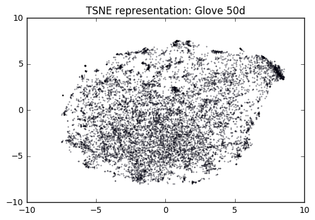

```python
#Import neccesary packages
import sys
sys.path.insert(0, './codes')
import torch
import numpy as np
import pandas as pd
import model
import data
import sklearn
import pickle
from sklearn.cluster import KMeans
import matplotlib.pyplot as plt
import pylab
from sklearn.manifold import TSNE
from scipy.spatial.distance import cdist
import collections
import gzip
import utilities
```

The RNN model are built from pytorch's word language model example:
https://github.com/pytorch/examples/tree/master/word_language_model

# GloVe pretrained embeddings

Following codes are used to process GloVe embeddings.

To download, please go to: http://nlp.stanford.edu/data/glove.6B.zip

To download more complex version: https://nlp.stanford.edu/projects/glove/

I wrote a function name load_glove_embeddings(glove_directory,emsize,voc_size) it takes in:

- glove_directory: the directory(default glove.6B) you save your glove embeddings 
- emsize: the embedding size of your glove embeddings must be one of 50,100 amd 300
- voc_size: number of vocabulary you want to load.


```python
# Example
glove = utilities.load_glove_embeddings(glove_directory='../datasets/glove.6B/',emsize=100,voc_size=60000)
```

utilities.load_glove_embedidngs returns a dictionary that keys are word and values are their associated embeddings. 


```python
#Example:
print(glove['something'])
```

    [  3.22570000e-02   4.43440000e-01   7.89090000e-01  -5.02990000e-01
      -1.36700000e-01   2.25930000e-01   1.74970000e-02   8.03780000e-02
       5.58670000e-01  -3.93530000e-01   8.93620000e-02   2.48500000e-01
       3.64070000e-02   6.29050000e-02  -1.09010000e-01  -3.80220000e-01
      -4.76150000e-01   5.77520000e-01  -4.53970000e-01   8.16040000e-01
       1.85400000e-01   1.49280000e-01  -4.37580000e-01  -1.18940000e+00
       2.68140000e-01   2.42320000e-01  -4.96370000e-01  -8.78740000e-01
       8.50260000e-02  -3.95630000e-01  -3.23830000e-01   8.76280000e-01
      -3.33490000e-02  -3.55440000e-01   1.73380000e-01   3.06580000e-01
      -6.52070000e-02   1.06230000e-02   1.31960000e-03  -5.64170000e-01
      -3.80900000e-02   3.47920000e-01   2.01200000e-01  -7.40410000e-01
      -8.29920000e-01  -1.81480000e-01   6.33650000e-01   4.02630000e-01
      -3.66790000e-01  -1.26540000e+00   3.73460000e-01  -1.15540000e-01
       1.32060000e-01   8.49850000e-01  -3.21940000e-01  -2.59480000e+00
       2.43500000e-01   2.19660000e-01   1.27470000e+00   3.61240000e-01
       1.53590000e-02   1.70820000e+00  -5.72510000e-01  -2.42550000e-01
       5.87750000e-01   1.27790000e-01   1.01420000e+00   1.41580000e-01
      -2.13590000e-01  -2.06910000e-01   2.49440000e-01  -3.44430000e-01
      -2.20540000e-01  -1.29830000e-01   6.96600000e-01   2.28320000e-01
      -1.46650000e-02  -4.45370000e-01  -8.78160000e-01   2.52690000e-01
       1.77810000e-01  -2.51750000e-01  -6.31270000e-01  -1.13460000e-01
      -1.42300000e+00  -2.62950000e-01   3.15130000e-01   9.98430000e-03
      -6.19750000e-01  -5.94330000e-01   2.33140000e-01   1.60890000e-02
      -1.03140000e-01  -3.10200000e-01  -9.12760000e-02  -5.31420000e-01
      -3.65420000e-01  -2.39290000e-01  -1.64640000e-02   6.82000000e-01]


# Loading saved model and its embedding
The main.py in ./codes will output a torch model file and a pickle file that contains useful information of model training.

An example of trained model file outputed by main.py can be obtained by simply running 
python main.py

Notice: If you train your model using a cuda device and your current torch does not have cuda compiled you will get error message when loading torch model.


```python
test_model = torch.load('../datasets/saved_models/LSTM_300_300_tied_0.2.pt')
```


```python
#Access embedding encoder
embeddings = test_model.encoder
```


```python
#Access the embedding of certain index
#Create a index tensor
index = torch.autograd.Variable(torch.cuda.LongTensor([1]))
#use embeddings(index)
print(embeddings(index).data.cpu().numpy())
```

    [[ 0.07147868  0.03646019 -0.03048867 ...,  0.01924909 -0.0136376
      -0.0771784 ]]


```python
embeddings.weight.data
```


    
    -5.4350e-02 -7.6253e-03 -2.9374e-02  ...   4.7515e-02  2.8029e-02 -7.0857e-02
     7.1479e-02  3.6460e-02 -3.0489e-02  ...   1.9249e-02 -1.3638e-02 -7.7178e-02
     8.0481e-02  1.2258e-01 -9.6451e-02  ...  -7.4125e-02  7.0022e-02  1.6076e-02
                    ...                   ⋱                   ...                
    -4.9423e-02  1.0117e-01  4.0854e-03  ...  -3.9028e-02 -2.0268e-01  1.8963e-01
    -4.3125e-02  6.2225e-03  6.2261e-02  ...  -1.1452e-01  7.3214e-02  2.3005e-02
    -1.8368e-01  1.4102e-01 -3.1606e-02  ...  -1.1025e-01  1.6185e-01  5.8586e-02
    [torch.cuda.FloatTensor of size 10000x1250 (GPU 0)]


```python
# Or load saved infosheets Python 3.5 needed
#import pickle
#with open('../../datasets/LSTM_1250_1250_tied_0.65.pk')as f:
#    info = pickle.load(f)
```

# Edited data.py


```python
corpus_penn = data.Corpus('./data/penn/')
#corpus_gutenberg = data.Corpus('./data/gutenberg_processed/')
```


```python
#Solve the python 3.5 decoding issue of guttenberg
#f = open('../../datasets/corpus_gutenberg.pk','wb')
#pickle.dump(file=f,obj=corpus_gutenberg)
```


```python
f = open('../../datasets/corpus_gutenberg.pk','rb')
u = pickle._Unpickler(f)
u.encoding = 'latin1'
corpus_gutenberg = u.load()
```


```python
f.close()
```

Corpus.dictionary module comes with handy lookup function between words and their associated index.

# Embedding Initialization

Can use the following codes to initialize embeddings weight before training. For those words does not existed in loaded pretrained GloVe embeddings, initialized them with uniform distribution between -1 and 1.


```python
initial_emb_weights = np.zeros(10000*50).reshape(10000,50)
unitialized_words = []
for idx,word in enumerate(corpus.dictionary.idx2word):
    try:
        initial_emb_weights[idx,:] = loaded_embeddings[words[word]]
    except:
        unitialized_words.append(word)
        initial_emb_weights[idx,:] = np.random.uniform(size=50,low=-1,high=1)
np.save('penn_Glove_10000.npy',initial_emb_weights)
```


```python
initial_emb_weights = np.zeros(10000*100).reshape(10000,100)
unitialized_words = []
for idx,word in enumerate(corpus.dictionary.idx2word):
    try:
        initial_emb_weights[idx,:] = loaded_embeddings_100d[words_100d[word]]
    except:
        unitialized_words.append(word)
        initial_emb_weights[idx,:] = np.random.uniform(size=100,low=-1,high=1)
np.save('penn_Glove_10000_100d.npy',initial_emb_weights)
```

Let's check how many words are initialized with pretrained embeddings.


```python
'%s out of 10000' % (10000-len(unitialized_words))
```


    '9290 out of 10000'


```python
#Initialize embeddings in torch
testModel = model.RNNModel('LSTM', 10000, 50, 50, 2,0.5)
testModel.cuda()
```


    RNNModel (
      (encoder): Embedding(10000, 50)
      (rnn): LSTM(50, 50, num_layers=2, bias=False)
      (decoder): Linear (50 -> 10000)
      (dropout): Dropout (p = 0.5)
    )


```python
initial_emb_weights = np.load('penn_Glove_10000.npy')
testModel.encoder.weight.data.copy_(torch.from_numpy(initial_emb_weights))
```


    
     1.2976e+00 -6.8898e-01  5.8863e-02  ...   1.5561e+00  1.2506e-01  6.1730e-01
    -7.7372e-01 -4.3496e-01  4.9961e-01  ...   1.0488e+00 -3.9849e-02 -7.0361e-01
    -8.5009e-01 -7.1816e-01 -7.6551e-01  ...  -2.3225e-01  1.1812e-01  6.7138e-02
                    ...                   ⋱                   ...                
     9.6991e-01  2.6161e-01  1.2579e+00  ...   5.7370e-01 -1.2297e+00  6.4438e-01
    -1.6767e-01 -7.0546e-01  3.8829e-01  ...   3.7024e-01 -2.6469e-01  5.2524e-01
     5.7114e-01  2.2081e-01 -9.1496e-01  ...   1.3575e-01 -3.7129e-01  4.2618e-02
    [torch.cuda.FloatTensor of size 10000x50 (GPU 0)]


# t-sne ploting

### Using t-stochastic neighbour embeddings (t-SNE) algorithm, we can easily build a 2-dimension representation of our trained high-dimension embeddings. We expect the 'similar' words to exist in similar context and we hope that the 2-dimension representation of our embeddings also shows this syntatic similarity by Euclidean distances in 2-D. 

Ignore the following lines if we are using numpy embedding weights file.


```python
# Using sklearn.manifold.TSNE package
# Documentation: http://scikit-learn.org/stable/modules/generated/sklearn.manifold.TSNE.html
#index_to_plot = torch.autograd.Variable(torch.LongTensor(np.arange(0,50,1)))
#Embeddings_to_plot = embeddings(index_to_plot).data
```

Let's check how well GloVe represents words cluster


```python
####Using preloaded embeddings
Embeddings_to_plot = initial_emb_weights
```

Use TSNE package to get the 2D representations of embeddings.


```python
from sklearn.manifold import TSNE
TSNE_model = TSNE(n_components=2,random_state=0)
```


```python
#Transfer to 2 dimensions
representations2D = TSNE_model.fit_transform(Embeddings_to_plot)
```


```python
#words_to_plot = corpus.dictionary.idx2word[:50]
```


```python
plt.scatter(representations2D[:,0],representations2D[:,1],s=0.1)
#for word_idx,word in enumerate(words_to_plot):
#    plt.annotate(word,representations2D[word_idx])
#plt.xlim([-100,100])
#plt.ylim([-100,100])
plt.title('TSNE representation: Glove 50d')
plt.show()
```





Let's Look at some trained embeddings diagram


```python
with open('../../datasets/LSTM_1250_1250_tied_0.65.pk','rb') as f:
            info_dict = pickle.load(f)
Embeddings_LSTM_1250_1250_tied_065 = info_dict['embeddings']
representations2D_penn = TSNE_model.fit_transform(Embeddings_LSTM_1250_1250_tied_065)
```


```python
np.save('rep2D_Penn.npy',representations2D_penn)
```


```python
f = open('../../datasets/LSTM_1250_1250_tied_0.65_gutenberg.pk','rb')
u = pickle._Unpickler(f)
u.encoding = 'latin1'
info_dict = u.load()
Embeddings_LSTM_1250_1250_tied_065_gutenberg = info_dict['embeddings']
representations2D_gutenberg = TSNE_model.fit_transform(Embeddings_LSTM_1250_1250_tied_065_gutenberg)
```


```python
np.save('rep2D_Penn.gutenberg',representations2D_gutenberg)
```

## Clustering of Embeddings


```python
representations2D_gutenberg=np.load('../../datasets/tsne_representations/rep2D_Penn.gutenberg.npy')
representations2D_penn = np.load('../../datasets/tsne_representations/rep2D_Penn.npy')
```


```python
kmeans_gutenberg = KMeans(init='k-means++', n_clusters=32, n_init=10)
kmeans_gutenberg.fit(representations2D_gutenberg)
kmeans_penn = KMeans(init='k-means++', n_clusters=30, n_init=10)
kmeans_penn.fit(representations2D_penn)
```


    KMeans(algorithm='auto', copy_x=True, init='k-means++', max_iter=300,
        n_clusters=30, n_init=10, n_jobs=1, precompute_distances='auto',
        random_state=None, tol=0.0001, verbose=0)


```python
def clusterPlot2D(rep2D,kmeans,savepath = 'TSNE_Plot',title='T-SNE representations'):
    plt.figure(figsize=(20,20))
    pylab.scatter(rep2D[:,0],rep2D[:,1],s=2,c=kmeans.labels_,cmap=pylab.cm.Accent)
    pylab.scatter(kmeans.cluster_centers_[:,0],kmeans.cluster_centers_[:,1],c='r')
    bbox_props = dict(boxstyle="rarrow", fc="cyan",pad=0.001, ec="b", lw=0.1)
    for center_idx,center in enumerate(kmeans.cluster_centers_):
        pylab.annotate(center_idx,center,bbox=bbox_props,rotation=45,va='top',ha='right')
    #for word_idx,word in enumerate(words_to_plot):
    #    plt.annotate(word,representations2D[word_idx])
    plt.title(title)
    plt.savefig('%s.png'%(savepath))
    plt.show()
```


```python
def zoom(rep2D,kmeans,corpus,index_to_zoom,closest = 100):
    cluster_index = kmeans.labels_
    cluster_centers = kmeans.cluster_centers_
    plt.figure(figsize=(10,10))
    specified_pos = np.where(cluster_index==index_to_zoom)[0]
    rep2D_to_plot = rep2D[specified_pos]
    #calculate the distances between each word and its cluster center
    center = cluster_centers[index_to_zoom]
    dist2ctr = cdist(center.reshape(-1,2),rep2D_to_plot.reshape(-1,2),'euclidean')[0]
    #Sort by Euclidean Dist
    mat = np.zeros(len(dist2ctr)*4).reshape(len(dist2ctr),4)
    mat[:,:2] = rep2D_to_plot
    mat[:,2] = dist2ctr 
    mat[:,3] = specified_pos
    sorted_mat = np.array(sorted(mat,key=lambda x:x[2]))
    first_N_rep = sorted_mat[:closest,:2]
    first_N_idx = [int(x) for x in sorted_mat[:closest,3]]
    words_to_annotate = [corpus.dictionary.idx2word[idx] for idx in first_N_idx]
    #pylab.scatter(rep2D_to_plot[:,0],rep2D_to_plot[:,1],s=2)
    pylab.scatter(first_N_rep[:,0],first_N_rep[:,1],s=2)
    pylab.scatter(cluster_centers[index_to_zoom][0],cluster_centers[index_to_zoom][1],c='r')
    for word_pos,coordinate in enumerate(first_N_rep):
        pylab.annotate(words_to_annotate[word_pos],coordinate)
    plt.show()
    return words_to_annotate
```


```python
clusterPlot2D(representations2D_gutenberg,kmeans_gutenberg\
              ,savepath='tsne_gutenberg.png',title='T-SNE representation: Gutenberg 1250d')
```


```python
clusterPlot2D(representations2D_penn,kmeans_penn,savepath='tsne_penn.png',title='T-SNE representation: Penn 1250d')
```


We did see some significant cluster such as cluster 3 and cluster 12. We can investigate those clusters qualitatively and see whether the word embeddings represents some words syntatic relations.

# Zoom in to see cluster

## Cluster 30-Gutenberg : Plural of Nouns


```python
#Gutenberg
print(zoom(representations2D_gutenberg,kmeans_gutenberg,corpus_gutenberg,index_to_zoom=30,closest=100))
```


    ['hunters', 'guests', 'couples', 'youths', 'servants', 'savages', 'soldiers', 'guards', 'princes', 'passengers', 'wretches', 'foreigners', 'retainers', 'horsemen', 'troopers', 'miners', 'cavaliers', 'folk', 'englishmen', 'regiments', 'troops', 'slaves', 'policemen', 'spectators', 'citizens', 'captains', 'seamen', 'lads', 'angels', 'detectives', 'females', 'males', 'parties', 'ladies', 'travellers', 'indians', 'sailors', 'frenchmen', 'officers', 'gentlemen', 'lawyers', 'adventurers', 'peasants', 'prisoners', 'pilgrims', 'chaps', 'grenadiers', 'strangers', 'travelers', 'fugitives', 'others', 'physicians', 'captives', 'boers', 'villagers', 'lovers', 'negroes', 'batteries', 'settlers', 'merchants', 'monks', 'leaders', 'labourers', 'whites', 'pirates', 'italians', 'boys', 'tribes', 'officials', 'infantry', 'crows', 'christians', 'blacks', 'farmers', 'natives', 'cadets', 'girls', 'creatures', 'thieves', 'barons', 'spaniards', 'professors', 'chiefs', 'managers', 'germans', 'porters', 'knights', 'priests', 'americans', 'generals', 'arabs', 'barbarians', 'inhabitants', 'missionaries', 'twins', 'nobles', 'doctors', 'danes', 'defenders', 'frogs']


## Cluster 10-Penn: Name and alias


```python
print(zoom(representations2D_penn,kmeans_penn,corpus_penn,index_to_zoom=10,closest=100))
```


    ['maria', 'kent', 'charlie', 'gregory', 'antonio', 'ruth', 'beth', 'ann', 'elliott', 'dave', 'margaret', 'harrison', 'marc', 'scott', 'mark', 'kerry', 'marlin', 'wayne', 't.', 'jacob', 'milton', 'ian', 'stuart', 'marshall', 'kim', 'justin', 'danny', 'bobby', 'sen.', 'russell', 'clifford', 'stanley', 'herbert', 'erich', 'andy', 'rep.', 'wilfred', 'francis', 'rudolph', 'joan', 'alice', 'tony', 'carlos', 'alex', 'saul', 'jerome', 'neal', 'harold', 'neil', 'lawrence', 'lord', 'murray', 'pierre', 'chuck', 'pete', 'jamie', 'arnold', 'louis', 'doug', 'craig', 'ed', 'karen', 'rick', 'ray', 'dale', 'gerard', 'leon', 'ken', 'mikhail', 'keith', 'linda', 'laurence', 'pat', 'chris', 'edgar', 'nancy', 'leo', 'mario', 'alvin', 'nicholas', 'ernest', 'messrs.', 'robin', 'kevin', 'ted', 'cynthia', 'don', 'maurice', 'glenn', 'kurt', 'dick', 'joel', 'nguyen', 'ben', 'leonard', 'timothy', 'barbara', 'j.p.', 'eugene', 'barry']

